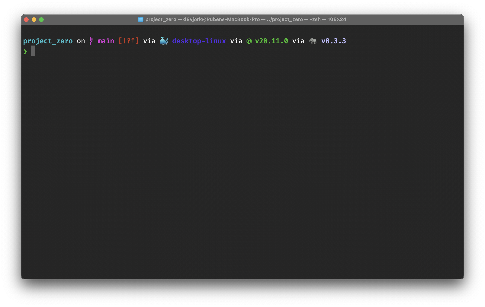

# Bonjour Mac


[](https://vscode.dev/github/d8vjork/bonjour-mac)

Let's give your new Mac a warm bonjour with an "D8vjork-style"

**Note: Requires a fresh installed Mac OS with nothing installed previously**

## Installation

> [!IMPORTANT]  
> Previous to this is recommended to run `xcode-select --install` to install some required dev stuff.

Just grab the [install.sh](install.sh) or execute this:

```bash
/bin/bash -c "$(curl -fsSL https://raw.githubusercontent.com/d8vjork/bonjour-mac/HEAD/install.sh)"
```

## What's inside?

All right... I'll try to make the list for you as much as I can:

### Brew terminal stuff and required utilities

- **php** Only stable releases on this as its my main programing language
- **composer** To manage PHP project dependencies (or global tools)
- **fnm** Faster than nvm (Node Version Manager) as its written in Rust and it just works!
- **jenv** A very recognised Java version manager, its a little bit different from nvm/fnm but helps a lot with Java home, etc variables replacements. **I need Java for React Native and Android/SmartTV development projects**.
- **pyenv** Like jenv but for Python, need Python for very few things, but mostly because of **nodegyp** (some Node dependencies build stuff using this which **is mainly Python based**)
- **gh** GitHub API CLI tool to manage PRs and some stuff Git clients just abstracts sometimes.. Tower can handle most of this, but terminal is always the best way :)
- **starship** A very handy terminal appearance that shows current project directory stuff like git branch, git status, package managers and languages versions involved
- **sheldon** Rust based terminal plugin management, so just **customise my terminal** experience in a **fast-boot way** (I used antigen but its been years since its last update)
- **terminal-notifier** I run a lot of background tasks that I leave at their own will meanwhile I do other stuff, **this will send a MacOS native notification whenever something wrong happens to them**
- **grep** Needed for easy swap PHP versions, kudos to https://localheinz.com/blog/2020/05/05/switching-between-php-versions-when-using-homebrew/ **required**
- **awscli** Used to manage all the EC2 servers or any other AWS services
- **qcachegrind** I use this sometimes for debugging PHP code with [XDebug profiling mode](https://xdebug.org/docs/profiler)
- **lazydocker** Really cool if you don't want to use the Electron-based webapp of Docker (which is also installed by this)
- **lazygit** If you feel tired to run all git commands to know stuff around your projects (otherwise pay yourself a gift license of [Tower]())
- **1password-cli** Used in company of **1password** (also installed by this) which is the perfect tool for securely store login details, passwords, debit cards, software licenses, secrets, stuff, SSH keys (integrated with this command with SSHAgent and other OS internal/external stuff), btw **its a paid membership but it  is REALLY worth the price**

The rest of the stuff I don't really need to mention, [find their utility by yourself](src/Brewfile) ;)

### Brew casks managed

- **Docker** (the one must-go, trying podman as well but I'm mostly friendly on simplicity)
- **iterm2**
- **VS Code** **main IDE**, also aliased so can do `code my_project_folder` and will open it with your folder
- **Sublime Text** for quick editting stuff, whenever VS Code eats my whole computer resources I use this as a second weapon
- **Hex Fiend** for quick editting HUGE files
- **Tower** **main GUI git client, you may need to pay for this so I'll let you choose**
- **Notion** **used for different companies organisation, you may need to pay for this if you want**
- **Spotify**
- **TablePlus** **used as my must-go database management app, just a must pay if you're an DBA or something in between like DevOps**
- **Google Chrome** **used as main** as a web dev for now is the only one that performs the best in Mac OS disabling some of the telemetry stuff
- **Firefox** (**good to have variety of engines to test on**, not using chrome/chromium because is using the exact same engines as Edge, V8 + Blink)
- **BetterZip** (must have / pay, specially for all the useful addons they add to Mac OS like the Preview one, supports a very large list of compression algos and formats)
- **IINA** Free and open source mpv based multimedia player, I use it specially for video, just a great Mac OS must-have, very well integrated
- **Shuttle** Useful open source to manage shortcuts like SSH servers
- **Tuxera NTFS** NTFS file system support for Mac OS (privative, but very handy)
- **SoundSource** Such a great app for something that Mac OS does not yet have, a per-app based volume controller + ecualizer & effects / postprocess, plus it can also control input/output devices!

### Mas CLI

**Personal recommendation here: Open each single app once all installed then click on the stuff they drop into the screen so they're ready to be used.**

- **Pixelmator Pro** Best alternative to Adobe's Photoshop as its not subscription based and has all I need (I'm no professional designer, but I can manage a few things tho)
- **Magnet** Very handy tool to snap windows all around your screen with different sizes attached to corners, sides... I personally recommend the piece of cake here: Do enable Dock auto-hide (do yourself a favour, it's not always useful as visible rather trouble)
- **Telegram** Because I hate WhatsApp :)
- **Dato** The best calendar widget that can make you quickly scheduled your meetings, personal events, etc
- **XCode** The best to develop Apple based applications, it also brings a lot of boilerplate out of the box stuff like Homebrew, git, ssh, etc (but I rather let you manage which SDKs you need once opened)
- **Bear** The best to take quick notes (it also has a mobile app too)
- **Slack** Only used to join some companies workspaces
- **Discord**
- Gaplin (useful, specially for the Preview addon that this adds to Mac OS, **just press space when an .svg file is highlighted in Finder**)
- **Transmit 5** Very useful to connect to file-based servers (all kind)
- **ColorSlurp** Quick & useful color picker integrated to the top bar

## End result on a project folder



## License

This project is unlicensed and will remain as is. All for your free joy guys.
